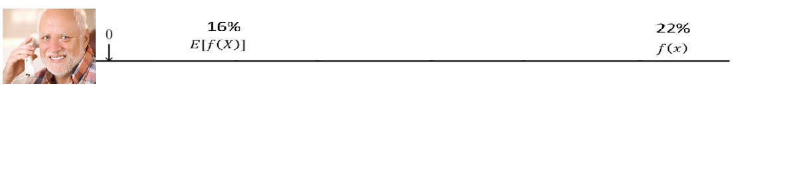
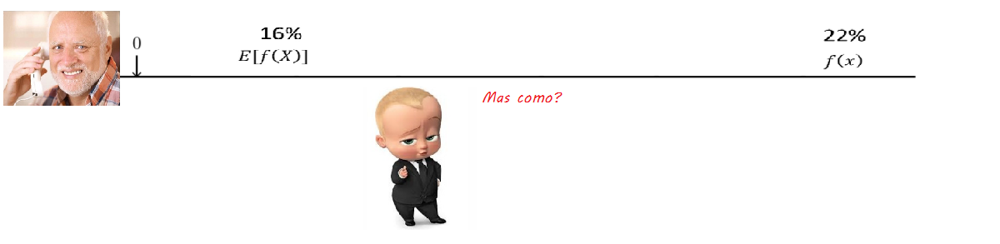
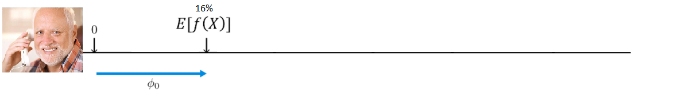
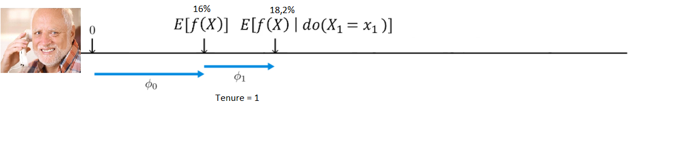
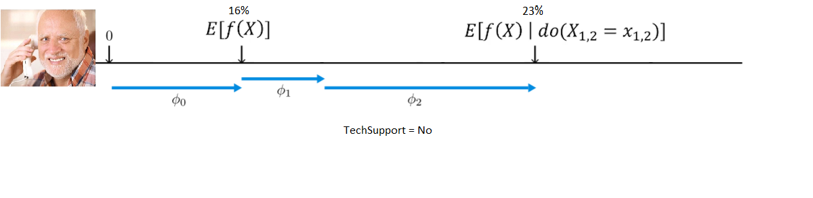
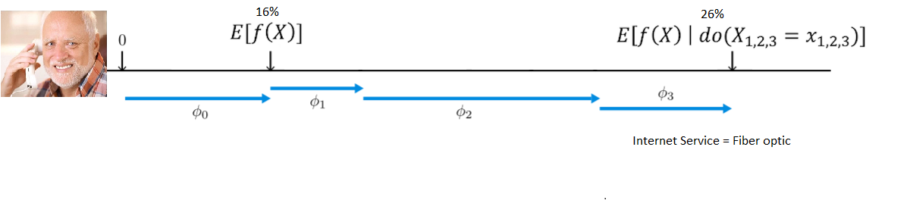
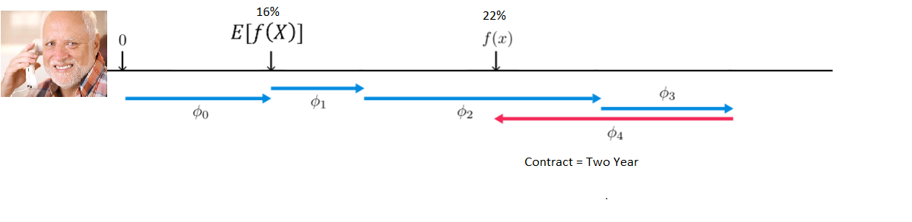

.pull-left[
### [Adriana dos Reis]( https://www.linkedin.com/in/reis-al/)
- Bacharel em Sistema de Informação - Mackenzie
- MBA Economia e Gestão Empresarial - FGV

### [Eliana Rigoni](https://www.linkedin.com/in/elianarigoni/?originalSubdomain=br)
- Bacharel em ADM - FACAMP
- Analista de Dados – IGTI 
- MBA ESALQ USP - cursando

]

.pull-right[
### [Ianní Muliterno](https://www.linkedin.com/in/iannimuliterno/)
- Cientista de dados na Unilever
- Bacharel em Estatística - UFPE


### [Regina Albanese Pose](https://www.linkedin.com/in/regina-albanese-pose-2300b4110/)
- Licenciada em Matemática - FSA
- Psicopedagoga clínica e institucional/lato sensu – São Marcos 
- Mestre em Ciências FMUSP
- Especialista em Poluição atmosférica e saúde humana/lato sensu – FMUSP
- Bacharel em Estatística - UNICAPITAL
]


---

# Proposta
## Dia 1
- Ferramentas importantes no dia-a-dia 

--

- Solução passo-a-passo de um case mostrando boas práticas no contexto _Mercado de trabalho_ 

--

- link com o Power.BI 


---

# Fluxo de trabalho na ciência de dados
```{r, echo = F }
knitr::include_graphics("data-science-workflow.png")
```
---

# Fluxo de trabalho na ciência de dados com Tidyverse
```{r, echo=F,out.width = '80%', fig.cap="<center><b>Fonte: Olivier Gimenez  <a href='https://oliviergimenez.github.io/intro_tidyverse/#1'> Introduction to the Tidyverse</a> </b></center>" }
knitr::include_graphics("01_tidyverse_data_science.png")
```

---

#Introdução 

##Telco Churn Analysis

- [Base](https://www.kaggle.com/blastchar/telco-customer-churn?select=WA_Fn-UseC_-Telco-Customer-Churn.csv): Informações dos consumidores da Telco - telecomunicações 

--

- Objetivo: Prever comportamento do consumidor ações em prol de mante-los. 


---
# Contextualização

* O que é Churn 
             

* churn da perspectiva da companhia  

  churn no nosso caso é deixar a empresa, então _o que a empresa pode fazer para reduzir a probabilidade do cliente sair da empresa? (churn) (melhorar areas que são importantes para o consumidor)_

* churn da perspectiva do cliente          

  _correlação entre churn e atributos do cliente ( identificar indicadores relacionados com o churn_
---
# Próximos passos


- Dataprep

- Análise exploratória

---
#Visão geral da base
```{r}
# Análise exploratória
print(str(dt))
```

---
#Análise Exploratória
```{r, include=F}

# com churn e aging
df_boxplot_medidas <- dt %>%
  group_by(Churn) %>%
  summarise(
    media = mean(tenure),
    mediana = median(tenure),
    desvio_padrao = round(sd(tenure),0)
  )
```

```{r include = T}
ggplot(data=dt, aes(x = Churn, y = tenure))+
  geom_boxplot( fill="#AF9DB4")
```
---
```{r, include=T}
ggplot(data=dt, aes(x = Churn, y = tenure))+
  geom_boxplot( fill="#AF9DB4")+

  labs(title = "Churn por aging",
       x = "Churn?",
       y = "Aging")+
  theme(plot.title = element_text(hjust = 0.5))+ #<<
  theme_minimal()+ #<<
  geom_point(data = df_boxplot_medidas,
             mapping = aes(x = Churn, y = media),
             colour = "#7A667F", size = 2)+
  geom_text(data = df_boxplot_medidas,
            mapping = aes(x = Churn, y = media,
                          label = format(media, digits = 0, nsmall = 0)),
            size = 3, vjust = 1.5
  )
```
---
#Análise Exploratória 

Cuidado com a escala

```{r}
ggplot(data = dt,
       aes(x = MonthlyCharges ))+
  geom_histogram(color = "white", fill = "lightblue" , bins = 30) +
  scale_x_continuous(breaks = seq( 0,
                                   max(dt$MonthlyCharges),
                                   by = 10)) +
  theme(plot.title = element_text(hjust = 0.5))+
  facet_wrap(~factor(Churn),  scales =  "free")+
  ggtitle("Churn vs Valor Mensal")+
  xlab("Valor mensal da Assinatura") +
  ylab("Frequência")+
  theme_minimal()

```
---
#Análise Exploratória
```{r, echo = T, warning=F}

mc_plot <- dt %>%
  select_if(is.numeric) %>%
  ggplot(aes(x = MonthlyCharges)) +
  geom_histogram()+
  ggtitle('Monthly Charges')+
  theme_minimal() #<<
```

```{r, out.width='50%'}
mc_plot_0_1 <- dt %>%
  ggplot(aes(x = MonthlyCharges)) +
  facet_wrap(vars(Churn)) +
  geom_histogram(alpha = 0.5)+
  ggtitle('Monthly Charges vs Churn')+
  theme_minimal()

gridExtra::grid.arrange(grobs = list(mc_plot,mc_plot_0_1))

```

---
#Análise Exploratória 

```{r}
mc_plot <- dt %>%
  select_if(is.numeric) %>%
  ggplot(aes(x = MonthlyCharges)) +
  geom_histogram()+
  ggtitle('Monthly Charges')+
  theme_minimal()
```

```{r, echo=T, warning=F, out.width='50%'}
  dt %>%
  ggplot(aes(x = MonthlyCharges, fill  = InternetService)) + #<<
  facet_wrap(vars(Churn)) +
  geom_histogram(alpha = 0.5)+
  ggtitle('Monthly Charges vs Churn') +
  theme_minimal()
```


---
#Análise Exploratória

```{r, echo = FALSE,warning=F}
# relacao entre aging e valor mensal

library(corrplot)

numericas <-  dt %>%
  select_if(is.numeric) %>%
  filter(!is.na(TotalCharges)) %>% 
  select(-SeniorCitizen)

res <- cor(numericas)

corrplot(res, type = "upper", order = "hclust",
         tl.col = "black", tl.srt = 45)
```


---
## IV e WOE

  Validando as evidências de poder preditivo 
  - Bins
  - weight of evidence
  $$
  WOE = \ln(\frac{\% de\underline\ não\underline\ eventos}{\% de\underline\ eventos})
  $$
  - Information Value
  $$
  IV = \sum(\%de\underline não\underline\ eventos - \% de\underline\ eventos) * WOE
  $$
```{r}
data.table::fread('IV	Predictive power
< 0.02	useless for prediction
0.02 - 0.1	weak predictor
0.1 - 0.3	medium predictor
0.3 - 0.5	strong predictor
> 0.5	suspicious or too good') %>% 
knitr::kable(format = 'html')
```
---

```{r, include = T, echo = T}
categoricas <- dt %>%
  mutate(SeniorCitizen = as.character(SeniorCitizen),
         churn_binario = as.character(ifelse(Churn == 'Yes',0,1))) %>%
  select_if(is.character) %>%
  select(-customerID,-Churn)


num_to_cat <- dt %>%
  select_if(is.numeric) %>%
  select(-1) %>%
  mutate(across(everything(),~cut(.x,breaks=5)))

names(num_to_cat)
```


```{r, include=T,echo = F,out.width='70%'}
num_to_cat %>% 
  group_by(tenure) %>% 
  count() %>% 
  bind_cols(num_to_cat %>% 
              group_by(MonthlyCharges) %>% count()) %>% 
                bind_cols(num_to_cat %>% 
                          group_by(TotalCharges) %>% 
                          count() %>% head(5)) %>% 
  janitor::clean_names() %>% 
  kableExtra::kable()
```

---
#IV para todas as variáveis
```{r, include=T}
variaveis_cat <- names(categoricas)[-17]


aux_iv <- categoricas %>%
  bind_cols(num_to_cat)

variaveis_cat <- c(variaveis_cat,names(num_to_cat))

lista_saida <- list()


for(cats_index in variaveis_cat){

  i <- which(variaveis_cat == cats_index)

  aux <- aux_iv %>%
    mutate(churn_binario = as.numeric(churn_binario)) %>%
    select(variavel = cats_index,churn_binario)

lista_saida[[i]] <- c(cats_index,IV(as.factor(aux$variavel), aux$churn_binario))
}
```

```{r, echo = F}
tab_iv <- data.frame(matrix(unlist(lista_saida), nrow=length(lista_saida), byrow=TRUE)) %>%
  select(var = 1,IV = 2)%>%
  mutate(IV = round(as.numeric(IV),4)) %>%
  arrange(desc(IV)) 


tab_iv %>%
  mutate(var = factor(var,rev(tab_iv$var))) %>% 
  ggplot(aes(y = var, x = IV)) +
  geom_bar(stat = 'identity') 
```

---
# WOE - entendendo impacto das variáveis
```{r, out.width= '70%'}

churn_binario <- ifelse(dt$Churn == 'Yes',0,1)
aux_woe <- WOETable(X= as.factor(aux_iv %>% pull(variaveis_cat[1])), Y = churn_binario)
aux_woe <- aux_woe[0,]

for(cats_index in variaveis_cat){

  aux_woe <- aux_woe %>%
    bind_rows(
      WOETable(X= as.factor(aux_iv %>% pull(cats_index)), Y = churn_binario) %>%
        mutate(variavel = cats_index)

      )


}


aux_woe %>%
  filter(variavel %in% tab_iv$var[1:6]) %>%
 # ggplot(aes(x = fct_reorder(CAT,WOE), y = WOE)) +
   ggplot(aes(x = CAT, y = WOE)) +
  geom_bar(stat = 'identity')+
   facet_wrap(~variavel,scales = 'free') +
  ggtitle("WOE das 6 variáveis com maior IV*")+
  theme_minimal()+
theme(axis.text.x=element_text(angle=45,hjust=1)) +
  labs(caption = "*Churn: sim = 0\n
                         não = 1")


```

---
#Perfil do Churner 
Com o resultado da análise exploratória bem comunicado é possível estruturar "O que esperar" e validar isso com seu _cliente_.

### Neste caso, podemos esperar que um churner em potencial: 
- Contrato mês-a-mês 
- Paga com cheque eletrônico 
- Tem pagamento mensal superior a $58,4 
- Internet Service: Fibra ótica 
- Não se interessa por serviços adicionais (aprofundar essa afirmação pode ser interessante)


---
##compreensibilidade do modelo

###modelos acurados  

Fornecem indicadores mais precisos, desta forma, pode representar maior lucro. 

Mas se você não pode explicar...

```{r, out.width = '45%'}

```

---
##compreensibilidade do modelo 

###modelos compreensíveis 

Faz sentido para o negócio (consumidor do modelo) 

Promove confiança e facilita a aceitação

```{r,out.width = '50%'}

```

---
#Modelos de predição para Churn  


* arvores de decisão 

  - Basicamente uma sequência de regras 
  - aplicação principal: Classificação 
  - Interpretável, mas sensível a assimetria da variável resposta e condições de variáveis categóricas de entrada, por exemplo. 

--

* regressão logistica  

  - Modelo estatístico bem difundido
  - Aplicação principal: Classificação
  - Interpretável e mais robusto. 

--

* SVM 

  - Pouco interpretável 
  - Acurado 
  - Robusto 


---

* Redes Bayesianas 

  - Interpretável porém pouco difundido 
  - Acurado 
  - Robusto 

--
* análise de sobrevivência 

  - Interpretável porém tem sua complexidade 
  - Possibilidade considerar tempo como uma variável. 

--
* xgboost (o popular) 

  - Robusto 
  - Acurado 
  - Hoje possui boas ferramentas de interpretação 

---
#processo de predição de churn

1 - o que é o churn nesse caso ( exemplo, loja online, o cliente para de comprar... mas pode apenas ter paraddo, x dias sem compra, y dias sem ligacao) 

2 - separar os grupos de treino e teste 

3 - buscando a maxima performance do modelo 

4 - direcionando ação 

---
#Dummyficação
```{r, echo = T, include=T}
leng_vars <- sapply(dt,
                        function(x) ifelse(is.character(x),n_distinct(x),NA))

leng_vars <- leng_vars[!is.na(leng_vars)]

categoricas <- dt %>%
     select_if(is.character) %>%
     select(names(leng_vars[leng_vars > 2])) %>%
   #  select(-customerID,-Churn)
    select(-customerID)

dummy <- dummyVars(" ~ .", data=categoricas)
newdata <- data.frame(predict(dummy, newdata = categoricas))

numericas <- dt %>%
  select_if(is.numeric)

entrada_xgb <- bind_cols(newdata,numericas)
entrada_xgb <- janitor::clean_names(entrada_xgb)
```
Replicar o mesmo tratamento para teste (idealmente, trate antes, divida depois)

```{r, include=F}
############################################################################
leng_vars <- sapply(test, function(x) ifelse(is.character(x),n_distinct(x),NA))
leng_vars <- leng_vars[!is.na(leng_vars)]

categoricas <- test %>%
  select_if(is.character) %>%
 select(names(leng_vars[leng_vars > 2])) %>%
  select(-customerID)

dummy <- dummyVars(" ~ .", data=categoricas)
newdata <- data.frame(predict(dummy, newdata = categoricas))

numericas <- test %>%
  select_if(is.numeric)

teste_xgb <- bind_cols(newdata,numericas)
teste_xgb <- janitor::clean_names(teste_xgb)
```
---
#Modelando com xgboost
DMatrix
```{r, include=T, echo=T}
index_treino <- sample(1:nrow(entrada_xgb),nrow(entrada_xgb)*0.75)

 treino <- entrada_xgb[index_treino,]
validacao <- entrada_xgb[-index_treino,]

treino <- xgb.DMatrix(as.matrix(treino)
                      , label = ifelse(dt$Churn[index_treino] == 'Yes',1,0)
                      )

validacao <- xgb.DMatrix(as.matrix(validacao)
                      , label = ifelse(dt$Churn[-index_treino] == 'Yes',1,0)
)


teste <- xgb.DMatrix(as.matrix(teste_xgb)
)
```
---
#Regularização 

- Muitas variáveis 

- Poucas observações 

- ambos...

```{r, include=T,echo = F, out.width='70%',fig.cap="<center><b>Fonte: Allison Horst  <a href='https://github.com/allisonhorst/stats-illustrations'> Understanding residuals</a> </b></center>"}
knitr::include_graphics("https://github.com/allisonhorst/stats-illustrations/raw/master/other-stats-artwork/dragon_residual.png")
```
---
#Regularização
- Ridge regression ou regularização L2 
  Usa o quadrado do coeficiente como penalidade ( note que $\lambda = 0$ representa MQO) 
  
$$\sum_{i=1}^n(y_i - \sum_{j=1}^px_{ij}\beta_j)^2 + \lambda\sum_{j=1}^p\beta_j^2$$
- Lasso regression ou regularização L1 

  Usa o valor absoluto como penalidade  
  
$$\sum_{i=1}^n(y_i - \sum_{j=1}^px_{ij}\beta_j)^2 + \lambda\sum_{j=1}^p|\beta_j|$$  

---
#Regularização com Xgboost
```{r, include = T, echo=T}
dt %>%
  summarise( sum(Churn == 'No')/sum(Churn == 'Yes'))

watchlist <- list(train = treino, eval = validacao)
parametros = list(
  max_depth = 3,
  eta = 0.15,
  colsample_bytree = 1,
  subsample = 1,
  objective = "binary:logistic",
  eval_metric = 'auc',
  scale_pos_weight = 2.76)

modelo <- xgb.train(data = treino,
                    nrounds = 20,
                    params = parametros,
                  watchlist)
```

O hiperparâmetro [scale_pos_weight](https://xgboost.readthedocs.io/en/latest/parameter.html)
---
```{r, include = F}
modelo <- xgb.train(data = treino,
                    nrounds = 20,
                    params = parametros,
                  watchlist)


treino_pred <- predict(modelo, treino)
valid_pred <- predict(modelo,validacao)

```

--- 
#Avaliando performance 

* ROC/auc - significa verdadeiros positivos vs falso positivo 

* lift metric 

* expected maximum profit measure - usa estivativa para valor do consumidor ajuda a entregar o treshhold otimo e o lucro esperado na situação atual 
---
#Avaliando Performance
```{r, warning=F,include=T,out.width='60%'}
dt[-index_treino,] %>%
   mutate(valid_pred) %>%
  ggplot(aes(x = valid_pred, fill = Churn)) +
  geom_histogram( alpha = 0.2)+
  ggtitle('Histograma do valor predito por Churn')

```
---
#Avaliando Performance - ROC/AUC
```{r}
 library(ROCit)
 ## Warning: package 'ROCit' was built under R version 3.5.2
 ROCit_obj <- rocit(score=treino_pred,class=dt[index_treino,]$Churn)
 plot(ROCit_obj)
```
---
#Youden index 

- Índice de melhor trade off entre sensibilidade $P(\hat{y}=1|y=1)$ e especificidade $P(\hat{y}=0|y=0)$ 

$$J = max_c(Sensibilidade_c + especificidade_c -1)$$
```{r, include = T, echo = T}
 library(ROCit)
 ROCit_obj <- rocit(score=treino_pred,class=dt[index_treino,]$Churn)
```
---
#Avaliando Performance - Lift Metric
```{r, include=T, warning=F, out.width='50%'}
churn_bin_lift <- ifelse(dt[index_treino,]$Churn == 'Yes',1,0)

lift_plot <- ordenacao_faixa(treino_pred,churn_bin_lift,10) %>%
 ggplot(aes(x = factor(faixa), y = perc)) +
  geom_bar(stat = 'identity') +
geom_text( #<<
          mapping = aes(x = factor(faixa), #<<
                        y = perc+0.1, #<<
                        label = format(paste(round(perc*100,2),'%'), digits = 0, nsmall = 1)), #<<
          fontface = "bold", size = 4, vjust = -0.5) + #<<
  geom_text( 
    mapping = aes(x = factor(faixa),
                  y = -0.1,
                  label = format(total, digits = 0, nsmall = 1)),
    fontface = "bold", size = 4, vjust = -0.5) +
  theme_minimal() +
  xlab('Decil') +
  ylab('Churn (%)') +
  ggtitle("Lift")
```

- Métrica popular no marketing 
- Auxilia no planejamento de ações (aplicável a soluções de classificação no geral)
```{r, out.width='70%'}
lift_plot
```

---
##Avaliando Performance - Lift Metric 

- A partir do plot de lift com a base de validação é possível direcionar uma ação e mensurar resultado
```{r}

validacao_pred <- predict(modelo, validacao)
valid_churn <- ifelse(dt[-index_treino,]$Churn == 'Yes',1,0)

ordenacao_faixa(validacao_pred,valid_churn,10) 
 
dt %>% 
  group_by(Churn) %>% 
  summarise(mean(MonthlyCharges))
```
---
#SHAP

Interpretador de modelos que combina teoria dos jogos e alocação ótima de crédito. 

- Shapley values, por Lloyd Shapley (Nobel de economia). Avalia contribuição de cada jogador, dado um jogo cooperativo e uma aliança de jogadores, sendo capaz de estimar uma "distribuição justa" dos ganhos para cada um.

```{r, echo = F, include=T}
knitr::include_graphics('shapleyvalues.png')
```

- Lida com multicolinearidade. (considera todos os subconjuntos em todas as ordens possíveis)
---
#SHAP 

- Eis que você tem um modelo, dando bons resultados e em produção 

- Então um cliente aparentemente satisfeito é avaliado

```{r}

```
--

- Existe uma coisa que o chefe quer saber
```{r}

```
---
#SHAP
```{r}

```
--
```{r}

```
--
```{r}

```
---
#SHAP
```{r}

```
--
```{r}

```
--
```{r}

```
---
## Resumo

- Ferramentas facilitadoras 

- Boas práticas/ Escolhendo como fazer 

- Traduzindo resultados 

- "Comunicação preventiva"

---

## Referências/Pacotes interessantes

### Aumentando as possibilidades!

- [Como mentir com Estatística](https://www3.unicentro.br/petfisica/2020/04/22/resenha-como-mentir-com-estatisticas/) 

- [Artigo SHAP](https://proceedings.neurips.cc//paper/2017/file/8a20a8621978632d76c43dfd28b67767-Paper.pdf) 

- [Data to viz](https://www.data-to-viz.com/) 

- [kableExtra](https://bookdown.org/yihui/rmarkdown-cookbook/kableextra.html) 

- [ggthemes](https://ggplot2.tidyverse.org/reference/ggtheme.html)

- [ggExtra](https://deanattali.com/2015/03/29/ggExtra-r-package/) 

- [formatR](https://yihui.org/formatr/)

- [clipr](https://github.com/mdlincoln/clipr)

---
#Muchas Gracias
